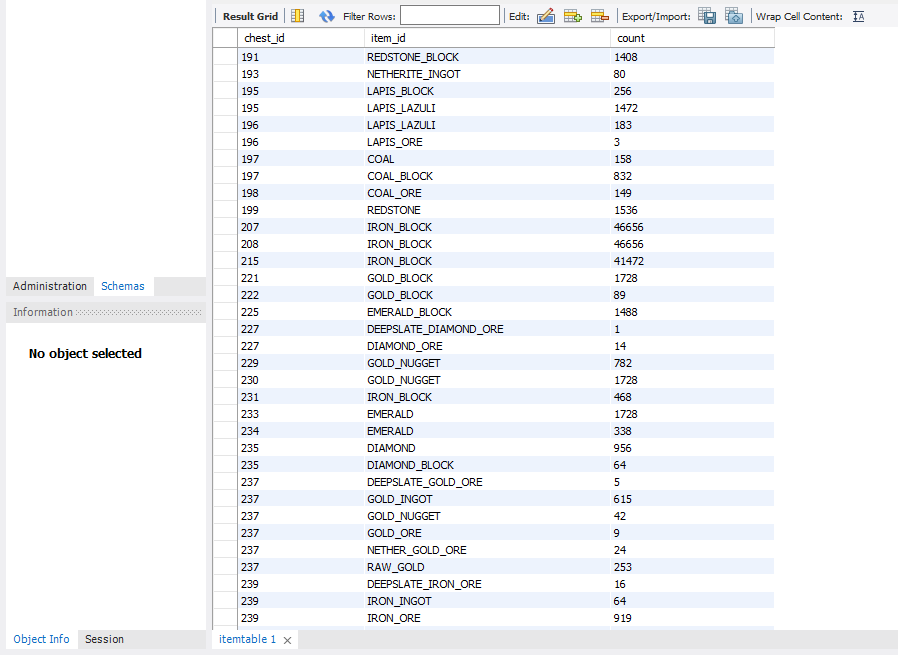

# 概要


マインクラフトのspigotサーバーで、チェストのアイテム情報のデータベースを作成するプラグインのソースコードです。
このデータベースでは、

**1. どのチェストに**

**2. 何のアイテムが**

**3. どのくらいあるのか**

を知ることができます。各チェストには固有のIDが割り当てられ、位置情報や所属情報が紐づけられています。所属情報は、施設名、グループ名、チェスト番号のような階層構造になっています。例えば、筆者のサーバーでは以下のような構造になっています。
```
倉庫（施設名）
    1F1G（グループ名）
        1（チェスト番号）
        2（チェスト番号）
    1F2G（グループ名）
        1（チェスト番号）
        2（チェスト番号）
        3（チェスト番号）
    ...

ゴーレムトラップ（施設名）
    B1F（グループ名）
        1（チェスト番号）
        2（チェスト番号）
...
```
---
データベースは５つのテーブルから構成されます。

### 1. Chests
チェストの位置情報を表しています。
```
chest_id            INT                     // チェストのID
world               VARCHAR(255)            // チェストがあるワールド名
x                   INT                     // チェストのx座標
y                   INT                     // チェストのy座標
z                   INT                     // チェストのz座標
```
### 2. ChestFacilityGroups
チェストが所属する施設名とグループ名を表しています。
```
chest_id            INT                     // チェストのID
facility_name       VARCHAR(255)            // 施設名
group_name          VARCHAR(255)            // グループ名
```
### 3. ChestNumbers
チェストのグループ内でのチェスト番号を表しています。
```
chest_id            INT                     // チェストのID
chest_number        INT                     // チェストの番号
```
### 4. ItemTable
それぞれのチェストに何のアイテムが何個あるかを表しています。
```
chest_id            INT                     // チェストのID
item_id             VARCHAR(255)            // アイテムのID
count               INT                     // アイテムの個数
```
### 5. ItemName
アイテムIDとアイテム名を紐づけます。
```
item_name           VARCHAR(255)            // アイテムの名前
item_id             VARCHAR(255)            // アイテムのID
```
  
# データベースの使用例

https://github.com/nadahaarkoi/item-management/assets/56178204/a3a8bedc-9b31-4e76-adc1-476174e10d02

このプラグインで作られるデータベースを用いて上のようなアイテム検索のwebアプリを作ることができます。<br>
ほしいアイテムの名前またはIDで検索を行い、アイテムの入っているチェストがどこにあるのかを調べます。施設名→グループ名→チェスト番号のように見ていくことで、チェストの場所がわかります。
<br>

# ソースコードの使い方
IntelliJ IDEAを使って開発することをおすすめします。Minecraftプラグインがあるので、それを使ってプロジェクトを作成することができます。
手順については[こちらのサイト](https://mcspigot.com/post-9/)を参考にしました。

### 1. package名の修正

ソースコードの５つのjavaファイルの先頭にpackageの行があり、そこをパッケージ名に修正します。パッケージ名は/プロジェクト名/src/main/java/の下のディレクトリ名です。ソースコードでは、`package com.some.comain.itemmanagementsystem`となっています。

### 2. plugin.ymlの修正

１行目にプラグイン名、３行目にpackage名を書きます。下の４行はサーバーにコマンドを追加するためのものなので、そのまま使います。

### 3. MySQLのセットアップ

MySQLをインストールします。workbenchも一緒にインストールするとGUIで操作できます。アカウントとコネクションを作り、スキーマを作成します。作成したスキーマで、以下のSQLを実行して５つのテーブルを作成します。
```SQL
CREATE TABLE chests (
    chest_id INT AUTO_INCREMENT PRIMARY KEY,
    world VARCHAR(255),
    x INT,
    y INT,
    z INT,
    UNIQUE (world, x, y, z)
);

CREATE TABLE ChestNumbers (
    chest_id INT,
    chest_number INT,
    FOREIGN KEY (chest_id) REFERENCES Chests(chest_id)
);

CREATE TABLE ChestFacilityGroups (
    chest_id INT,
    facility_name VARCHAR(255),
    group_name VARCHAR(255),
    FOREIGN KEY (chest_id) REFERENCES Chests(chest_id)
);

CREATE TABLE ItemTable (
    chest_id INT,
    item_id VARCHAR(255),
    count INT,
    PRIMARY KEY (chest_id, item_id),
    FOREIGN KEY (chest_id) REFERENCES Chests(chest_id)
);

CREATE TABLE ItemName (
    item_name VARCHAR(255),
    item_id VARCHAR(255)
);
```
テーブルを作成したら、config.ymlにデータベース接続情報を入力します。dbnameはスキーマ名です。
ItemNameにはitemname.csvの内容を事前にインポートします。

### 4. バージョンの変更

plugin.ymlとpom.xmlに書かれているspigotサーバーやMySQLのバージョンを適宜変更します。

### 5. ファイルの配置

プロジェクトの作成時に、メインクラス名.javaというファイルが生成されていると思います。そのファイルがあるディレクトリに５つのjavaファイルを配置して、生成されたjavaファイルは削除します。plugin.ymlとconfig.ymlはresourcesディレクトリに配置し、pom.xmlファイルは一番上のディレクトリに配置します。もともとあるplugin.ymlとpom.xmlは削除してください。

### 6. jarファイルの生成

実行ボタンを押してjarファイルを生成します。targetディレクトリに生成されるので、spigotサーバーのpluginsディレクトリに配置してサーバーを再起動してください。

# プラグインの使い方
大まかな流れは、

1. 施設名を決定
2. チェストの登録
3. アイテムテーブルの更新

となります。ゲーム内でコマンドを入力することによって行うことができます。

**以下はコマンドの一覧です。**

`imsystem set facility [施設名]`

- 登録するチェストの施設名をセットします。これ以降のチェストの追加はすべてこれで指定した施設名で行われます。

`imsystem axe`

- カスタム斧を得ることができます。この斧でチェストをクリックすることにより、登録するチェストを選択することができます。

`imsystem register as [グループ名]`

- 斧で選択したチェストを指定したグループ名で登録します。

`imsystem make [施設名] [グループ名]`

- 指定した施設のグループのチェストについて、アイテムテーブルを更新します。

**基本的なコマンドは以上になります。以下はその他のコマンドです。**

`imsystem add to [施設名] [グループ名]`

- 斧で選択したチェストを指定した施設のグループに追加します。チェスト番号は既に登録されているチェストに続くように登録されます。

`imsystem make all`

- すべてのチェストについてアイテムテーブルを更新します。

`imsystem make chest [ワールド名] [X座標] [Y座標] [Z座標]`

- 指定した位置のチェストについてアイテムテーブルを更新します。

`imsystem reset_clickedchest`

- 斧で選択したチェストをすべてリセットします。

`imsystem rename [元の施設名] [元のグループ名] as [新しい施設名] [新しいグループ名]`

- 指定した施設のグループの名前を変更します。

`imsystem rename [元の施設名] as [新しい施設名]`

- 指定した施設の名前を変更します。

`imsystem delete chest [ワールド名] [X座標] [Y座標] [Z座標]`

- 指定した位置のチェストをすべてのテーブルから削除します。

`imsystem delete group [施設名] [グループ名]`

- 指定した施設のグループのチェストをすべてのテーブルから削除します。

`imsystem delete facility [施設名]`

- 指定した施設のチェストをすべてのテーブルから削除します。

`imsystem group of [施設名]`

- 指定した施設のグループ名を列挙します。

`imsystem group`

- グループごとに登録されているチェストの数を列挙します。

`imsystem chest of [施設名] [グループ名]`

- 指定した施設のグループのチェストの位置情報を列挙します。

